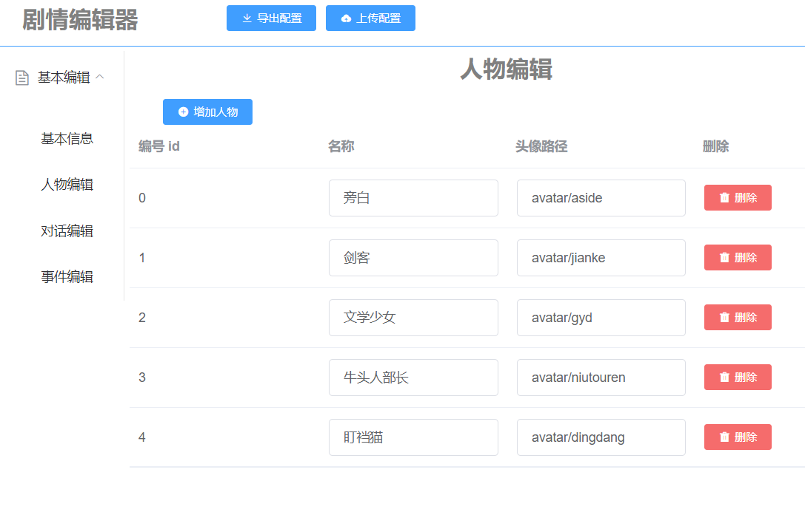

# 剧情编辑器

用于编辑剧情 josn 文件的编辑器，可以少输入很多括号和引号和提高配置效率。

## 在线使用

* 请使用电脑浏览器访问（建议 chrome 浏览器）访问以下链接
* http://jiankesword.gitee.io/plot_editor_build

### 剧情预览

* http://jiankesword.gitee.io/plot_demo_build_desktop

### 代码编写

* https://gitee.com/jiankesword/cc_plot_demo

## 使用说明

### 第一次使用

1. 先点击人物编辑，配置好人物，名称和头像地址都是必填的
    - 头像地址（游戏加载图片的 url，在 cocos creator 中是相对于 resources 目录的相对路径，或者网络地址）
2. 进行对话编辑
    - 先新增剧情
    - 然后点击新增的剧情
    - 增加一条对话，选择对话的人物和对话内容
3. 点击页面头部的导出配置，浏览器会下载编辑好的文件

### 使用建议

1. 多导出备份，善用上传功能

## 图片预览

## 开发

### 技术栈

* Vue + vuex + vue-router + element-ui

### 如何运行工程

* 需要安装 node.js , version 8+
* 将项目 clone 至本地，运行 npm install 下载依赖
* 下载完依赖后 npm run serve 即可运行本项目
* 构建: npm run build

## 需求 & bug

* 欢迎 issue 或者留言

## 支持作者

* 鼓励和支持作者提升作者用爱发电的效率
* 以太坊钱包地址 0x56440C5b613821A9d19DbC15e1d07dD35b426d18
* **火鸡面**淘口令： ￥ygZncagVzXB￥
